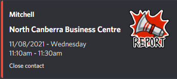

# Discord ACT COVID-19 Notifications
Discord bot that periodically scrapes the ACT COVID-19 website for exposure sites and sends alerts.

 
# Contents #
[Installation](#installation)  
[Commands](#commands)  


# Installation  
Make sure you have [discord.py](https://discordpy.readthedocs.io/en/stable/) installed.  
Clone/download this repo and navigate to it and ensure you have the rest of the requirements in `requirements.txt`.

Replace `YOUR_TOKEN_HERE` with your discord bot's token.

```
python bot.py
```
  
# Commands  
**Subscribe**: !subscribe *[loc1]* *[loc2]* ..  
Subscribe a channel to notifications. Optional arguments are if you only want to be notified about particular suburbs. Replace suburbs with spaces with underscores.


**Unsubscribe**: !unsubscribe *[loc1]* *[loc2]* ..  
Unsubscribe a channel to notifications. Optional arguments are if you only want to remove notifications for particular suburbs. Replace suburbs with spaces with underscores.


**Subscribed**: !subscribed  
View notification status.
